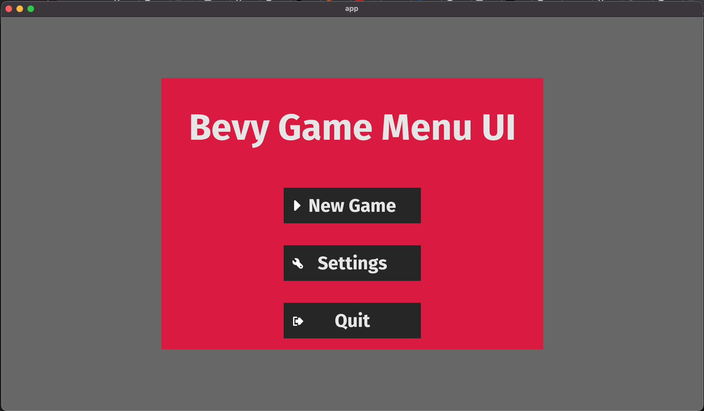

# BevyMenuExample
A larger version of the Bevy menu example - expanded modules out to separate files 
and removed some bits that weren't working - at least, on Windows and in Bevy 0.9 
which is the one I've tested with. I hope to make this more comprehensive in the 
future. 

### Project Outline
The framework here gives an example of moving between menu screens and setting some global 
variables based on the settings screen. 

### Background
This project was taken from the [Bevy Game Menu Example](https://github.com/bevyengine/bevy/blob/main/examples/games/game_menu.rs)
in the Bevy Engine project. The example is a good overview but was put into one large file.
This project expands that out to multiple files, making it a bit easier to understand.
It can be used as boilerplate to start a new project, where all setup and game loop 
items can be put straight into game.rs->game_setup and game.rs->game, respectively.

### Updates

20th Feb '23 - Updated example menu to use Bevy 0.9 with no warnings. 

### Copyright
I lay claim to no copyright on this material, all copyright should be considered retained 
by the original authors: https://github.com/bevyengine/bevy
